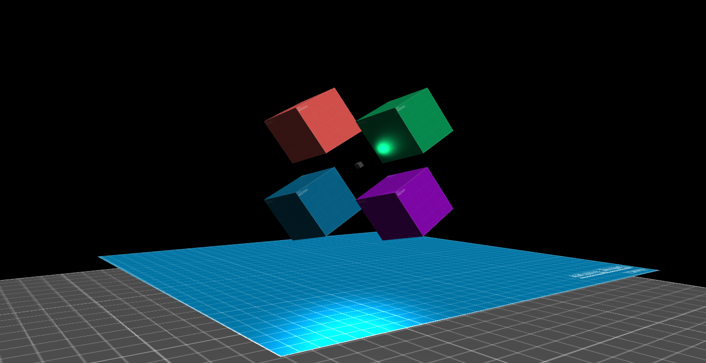

# WebGL

WebGL with vite, typescript, vitest, eslint and prettier



## TODO

-   ~~Cube primitive~~
-   ~~Plane primitive~~
-   ~~Directional lighting~~
-   ~~Ambient~~
-   ~~Specular lighting~~
-   Window events inside renderer's update function
-   ~~Image reader async function~~
-   Single buffer draw
-   Sphere primitive
-   Models loader
-   Ray casting / click detect
-   Sceleteal animation
-   Physics

## Installation

```bash
npm install
```

## Commands

```bash
npm run dev     # run app in dev mode
npm run build   # build app
npm run preview # run builded app
npm run test    # run cli tests
npm run test-ui # run tests gui
```

## Linter

```bash
npx eslint .
npx eslint . --fix
```

## Prettier

```bash
npx prettier . --check
npx prettier . --write
```

## Contributing

Pull requests are welcome. For major changes, please open an issue first
to discuss what you would like to change.

Please make sure to update tests as appropriate.
